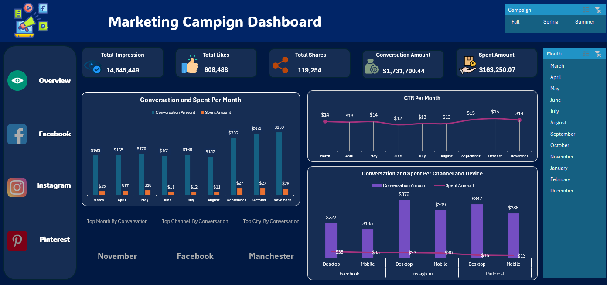

### 📌 Project Title & Overview

    📊 This project analyzes multi-platform marketing campaign data to extract actionable insights using only Microsoft Excel.

### 🎯 Objectives

      - Identify the most cost-effective marketing channels
      - Highlight high-performing cities for targeted marketing
      - Analyze trends in clicks, conversions, and spend over time
      - Analyze CTR over time.
      - Analyze Conversation Per Campaign.
      
### 🔍 Key Insights

  **📈 Channel Performance**
   
            - Facebook led in total impressions and clicks.
            - Instagram had the highest conversion rate and best cost-per-conversion.
            - Pinterest had lower clicks but surprisingly high engagement per click.
            - Facebook campaigns had the highest cost per click and the highest cost per conversion with the least conversion amount, time to take action.

   **💻 Device Efficiency**
   
            - Desktop users contributed to more conversions and lower CPC overall.
            - Balanced budget across devices is key.

   **🌍 Geographic Breakdown**
   
            - Birmingham yielded the highest ROI and lowest spent amount, making it ideal for future budget allocation.
            - Use this to prioritize ad spend regionally.

   **⏳ Time Trends**
   
            - Quarter 4 has the highest Conversion amount compared to Q2&Q3.
            - Recommend ramping budget at the beginning of each run.

   **❤️ Engagement Metrics**
   
            - Facebook had the highest engagement score per impression.

---

### 💡 Tools Used

      - **Microsoft Excel** (Pivot Tables, Line/Bar/column Charts)

---

### 📸 Sample Visuals

| Main Dashboard | 

| Channel Performance | 

|  | 
---

## ▶️ How to Use

1. Open the Excel file in `analysis/Marketing Campaign Analysis Dataset.xlsx`
2. Navigate through the tabs:
   - `Pivot_Channels`, `Pivot_Devices`, `Geo_Analysis`, `Time_Trends`, etc.
3. Interact with slicers and filters to dynamically view data
4. Explore insights in `reports/Summary_Report.md` or `.pptx` format

## 👤 Let's Connect!

[LinkedIn](https://www.linkedin.com/in/ahmed-eissa-837691a1/) 
